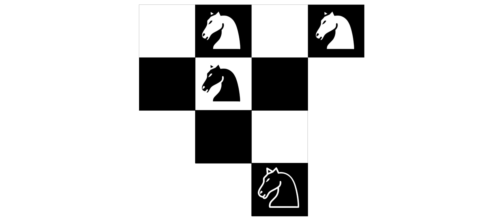
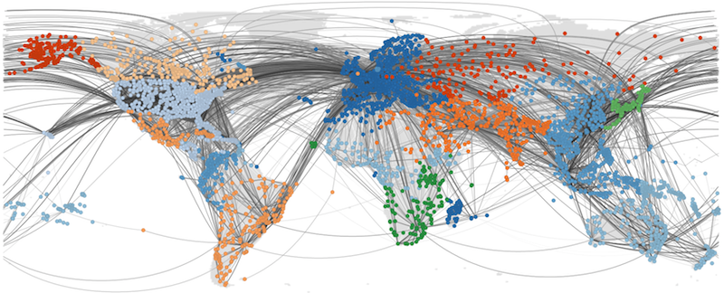

# NetPy '21: Introduction to Network Science in Python

###### Workshop instructor

[Lovro Šubelj](http://lovro.fri.uni-lj.si), University of Ljubljana

###### Workshop schedule

Tuesday, 14th December 2021 at 4:00 PM (4 hours with breaks)

###### Workshop location

Lecture room 3 at [UL FRI](http://www.fri.uni-lj.si), Večna pot 113, Ljubljana, Slovenia

###### High-level description

This workshop is primarily aimed at Python programmers, either academics, professionals or students, that wish to learn the basics of modern network science and practical analyses of real networks, such as social, information and biological networks. Familiarity with the basics of probability theory and statistics, linear algebra, and machine learning is strongly encouraged.

The workshop is based on masters level course [Network Analysis](https://lovro.fri.uni-lj.si/posters/frinets.pdf) offered at the University of Ljubljana, Faculty of Computer and Information Science.

###### Recommended prerequisites

It is recommended that attendees bring a laptop with working installation of [Python](http://www.python.org), [NetworkX](http://networkx.github.io), [CDlib](http://cdlib.readthedocs.io) and [node2vec](https://snap.stanford.edu/node2vec/) packages. Alternatively, you can work with any other network analysis package such as [igraph](http://igraph.org), [graph-tool](http://graph-tool.skewed.de) or [SNAP.py](http://snap.stanford.edu/snappy/). For visualization of smaller networks, it is recommended to install some network analysis software such as [Gephi](http://gephi.org) or [visone](http://visone.info).

###### Tentative syllabus

+ **Challenge**: Warmup with four knights challenge (5 min)

1. From classical graph theory to **modern network science** (15 min)
2. **Large-scale structure** of real networks and **graph models** (45 min)
3. Measures of **node importance** and **link analysis** algorithms (45 min)
4. Network **community structure**, blockmodeling and **core-periphery** (45 min)
5. Network **visualization**, **machine learning** and some applications (45 min)

+ **Hands-on**: Abstraction, centrality, communities, visualization, learning etc. 

###### Networks data

All networks are available in Pajek, edge list in LNA formats.

+ [Simple toy example network](https://github.com/lovre/netpy21/blob/master/nets/toy.net) (5 nodes)
+ [Zachary's karate club network](https://github.com/lovre/netpy21/blob/master/nets/karate.net) (34 nodes)
+ [Davis's southern women network](https://github.com/lovre/netpy21/blob/master/nets/women.net) (32 nodes)
+ [Lusseau's bottlenose dolphins network](https://github.com/lovre/netpy21/blob/master/nets/dolphins.net) (62 nodes)
+ [Game of Thrones character appearance network](https://github.com/lovre/netpy21/blob/master/nets/got-appearance.net) (107 nodes)
+ [Human diseasome network by common symptoms](https://github.com/lovre/netpy21/blob/master/nets/diseasome.net) (117 nodes)
+ [Conflicts and alliances between world nations](https://github.com/lovre/netpy21/blob/master/nets/wars.net) (180 nodes)
+ [Game of Thrones character kills network](https://github.com/lovre/netpy21/blob/master/nets/got-kills.net) (284 nodes)
+ [Ljubljana public bus transport network](https://github.com/lovre/netpy21/blob/master/nets/lpp.net) (416 nodes)
+ [US airplane traffic transport network](https://github.com/lovre/netpy21/blob/master/nets/transport.net) (1,323 nodes)
+ [Java software class dependency network](https://github.com/lovre/netpy21/blob/master/nets/java.net) (1,516 nodes)
+ [Ingredients network by common compounds](https://github.com/lovre/netpy21/blob/master/nets/ingredients.net) (1,525 nodes)
+ [Map of Darknet from Tor network](https://github.com/lovre/netpy21/blob/master/nets/darknet.net) (7,178 nodes)
+ [IMDb actors collaboration network](https://github.com/lovre/netpy21/blob/master/nets/imdb.net) (17,577 nodes)
+ [Human protein-protein interaction network](https://github.com/lovre/netpy21/blob/master/nets/ppi.net) (19,634 nodes)
+ [WikiLeaks cable reference network](https://github.com/lovre/netpy21/blob/master/nets/wikileaks.net) (52,416 nodes)
+ [Internet map of autonomous systems](https://github.com/lovre/netpy21/blob/master/nets/internet.net) (75,885 nodes)
+ [Amazon product copurchase network](https://github.com/lovre/netpy21/blob/master/nets/amazon.net) (262,111 nodes)
+ [Paper citation network of APS](https://github.com/lovre/netpy21/blob/master/nets/aps.net) (438,943 nodes)
+ [Small part of Google web graph](https://github.com/lovre/netpy21/blob/master/nets/google.net) (875,713 nodes)
+ [Road/highway network of Texas](https://github.com/lovre/netpy21/blob/master/nets/texas.net) (1,379,917 nodes)

## Guimera's four knights challenge

Challenge will be **revealed in class** =)

## 1. Classical graph theory → modern network science

###### Brief description

Introduction of networks and selected **motivational examples**. From **classical graph theory** to social network analysis and **modern network science**. Network perspectives in different **fields of science**.

###### Lecture slides

+ [**Networks introduction and motivational examples**](https://github.com/lovre/netpy21/blob/master/lectures/01-intro.pdf)
+ [**Brief historical development of network science**](https://github.com/lovre/netpy21/blob/master/lectures/02-history.pdf)
+ [**Network perspectives through science**](https://github.com/lovre/netpy21/blob/master/lectures/03-perspects.pdf) (tentative)

###### Book chapters

+ Ch. 1: [Introduction](http://networksciencebook.com/chapter/1) in Barabási, A.-L., [_Network Science_](http://networksciencebook.com) (Cambridge University Press, 2016).
+ Ch. 1-5: Introduction etc. in Newman, M.E.J., [_Networks: An Introduction_](https://global.oup.com/academic/product/networks-9780198805090?cc=si&lang=en&) (Oxford University Press, 2010).
+ Ch. 1: [Overview](https://www.cs.cornell.edu/home/kleinber/networks-book/networks-book-ch01.pdf) in Easley, D. & Kleinberg, J., [_Networks, Crowds, and Markets_](https://www.cs.cornell.edu/home/kleinber/networks-book/) (Cambridge University Press, 2010).

###### Selected must-reads

+ Barabási, A.-L., The network takeover, _Nat. Phys._ **8**(1), 14-16 (2012).
+ Motter, A.E. & Yang, Y., The unfolding and control of network cascades, _Phys. Today_ **70**(1), 33-39 (2017).
+ Cramer, C., Porter, M.A. et al., [_Network Literacy: Essential Concepts and Core Ideas_](https://sites.google.com/a/binghamton.edu/netscied/Network-Literacy-low-res.pdf?attredirects=0) (Creative Commons Licence, 2015).

###### Selected papers

+ Newman, M.E.J., The physics of networks, _Phys. Today_ **61**(11), 33-38 (2008).
+ Cimini, G., Squartini, T. et al., [The statistical physics of real-world networks](https://arxiv.org/abs/1810.05095), _Nat. Rev. Phys._ **1**(1), 58-71 (2019).
+ Newman, M.E.J., Communities, modules and large-scale structure in networks, _Nat. Phys._ **8**(1), 25-31 (2012).
+ Vespignani, A., Modelling dynamical processes in complex socio-technical systems, _Nat. Phys._ **8**(1), 32-39 (2012).
+ Hegeman, T. & Iosup, A., [Survey of graph analysis applications](https://arxiv.org/abs/1807.00382), e-print _arXiv:180700382v1_, pp. 23 (2018).
+ Hidalgo, C.A., Disconnected, fragmented, or united? A trans-disciplinary review of network science, _Appl. Netw. Sci._ **1**, 6 (2016).

## 2. Large-scale network structure and graph models

### TBD